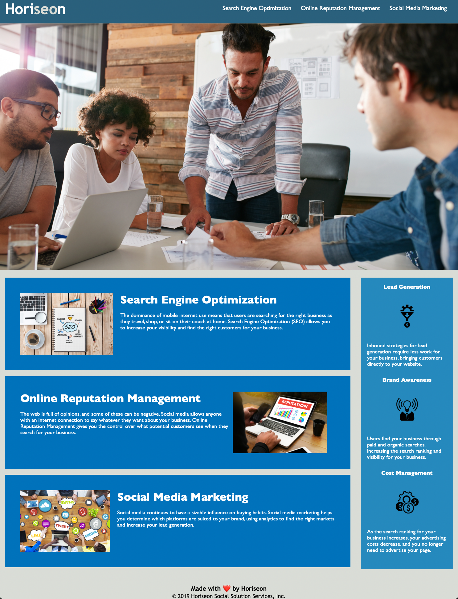

# Horiseon-Accessibility
Making a web page more accessibility-friendly.

## Overview
The purpose of this project was to take a previously existing web page and making it more accessible. In addition to making the site more accessible, its Search Engine Optimization is improved, and certain aspects of the code has been consolidated. 

During this project all the generic `
` tags were replaced with their appropriate semantic HTML elements. This occassionally created problems with the CSS stylesheet but were fixed. In addition to this, the CSS stylesheet was consolidated and reorganized into clear sections with comments explaining what each section corresponds to on the site.

## What it looks like
The following image is a screenshot of the completed web page, after making all the various changes.

## The live page
The live web page can be viewed at the following link: https://tonyq032.github.io/Horiseon-Accessibility/